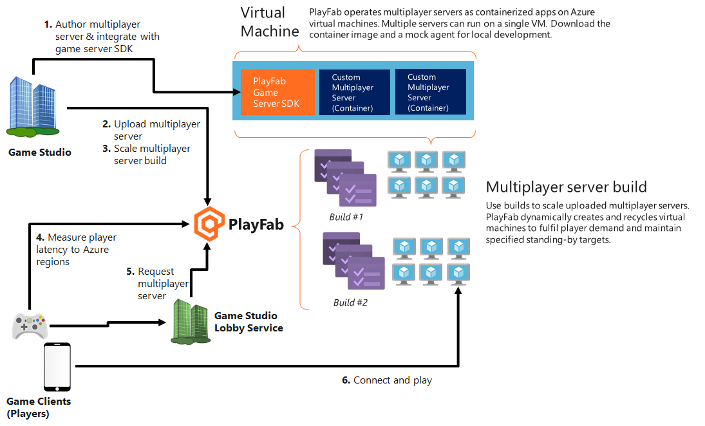

# Multiplayer Servers

PlayFab's multiplayer server hosting service allows you to operate a dynamically scaling pool of custom game servers in Azure.

All PlayFab indie, pro, and enterprise tier customers can access the service and use a limited, free quota of multiplayer servers for product evaluation and testing. Because we're still improving the portal experience, samples, and documentation, this service is in a **preview** mode.

There are three key concepts to PlayFab multiplayer servers:

1. **Game server executable**. This is the application that you are running in Azure. This server may be a simple network repeater, a fully authoritative game server running physics and AI, or anything in between.
2. **Build**. This is the game server executable, packaged with assets and certificates needed to run the game. This content can be uploaded as individual certificates, zip files, and/or a container image. If you do not need a custom container image, you can use PlayFab managed Windows containers.
3. **Game server**. A container running your game server executable. There may be multiple servers running on a single virtual machine.

These are the typical steps for using the service:

1. **Author game server**. Scaling your server requires integration with the PlayFab game server SDK (GSDK) and testing the server executable in a container. You can download a mock agent and the Windows container image PlayFab uses for local development.
2. **Upload game server executable and assets**. Upload the server and manage builds through Game Manager or PlayFab APIs and SDKs.
3. **Scale game server build**. Once you've uploaded server assets you can create *builds*. PlayFab dynamically creates and recycles virtual machines to fulfill player demand and maintain standing-by levels you specify.
4. **Measure player latency**. When players initiate a multiplayer experience, send UDP messages to PlayFab quality-of-service (QoS) beacons to measure network latency to Azure.
5. **Request multiplayer server**. When players need a multiplayer server, request one to be allocated from a build's standing-by pool. This request can come from a lobby or matchmaking service you operate, or directly from a client calling PlayFab.
6. **Connect and play**. PlayFab will fulfill a server request within 1 second if standing-by servers are available. Once a server has been put into the active state, clients connect to the server and play.

## Conceptual Documentation

- **Quickstarts**
  - [Quickstart for multiplayer servers (API/PowerShell)](quickstart-for-multiplayer-servers-api-powershell.md)
  - [Quickstart for multiplayer servers (Game Manager)](quickstart-for-multiplayer-servers-game-manager.md)

- **Authoring a game server**
  - [Basics of a PlayFab game server](basics-of-a-playfab-game-server.md)
  - [Integrating game servers with the PlayFab game server SDK (GSDK)](integrating-game-servers-with-gsdk.md)
  - [Locally debugging game servers and integration with PlayFab](locally-debugging-game-servers-and-integration-with-playfab.md)

- **Managing server builds**
  - [Deploying PlayFab multiplayer server builds](deploying-playfab-multiplayer-server-builds.md)
  - [Archiving and retrieving multiplayer server logs](archiving-and-retrieving-multiplayer-server-logs.md)
  - [Lifecycle of multiplayer server builds](multiplayer-build-lifecycle.md)
  - [Lifecycle of a multiplayer server build region](multiplayer-build-region-lifecycle.md)

- **Connecting clients and requesting servers**
  - [Using quality-of-service (QoS) beacons to measure player latency to Azure](using-qos-beacons-to-measure-player-latency-to-azure.md)
  - [Allocating game servers and connecting Visual Studio debugging tools](allocating-game-servers-and-configuring-vs-debugging-tools.md)
  - [Connecting clients to game servers](connecting-clients-to-game-servers.md)

- **Limits and billing**
  - [Accessing increased core limits and additional Azure regions](identifying-and-increasing-core-limits.md)
  - [Billing for PlayFab Multiplayer Servers 2.0](billing-for-thunderhead.md)
  - [Multiplayer Servers - detailed spec sheet](multiplayer-servers-detailed-price-sheet.md)

## Reference Documentation, Samples, and Tools

- [Multiplayer Server API Reference](xref:titleid.playfabapi.com.multiplayer.multiplayerserver)
- [PowerShell Module](https://www.powershellgallery.com/packages/PlayFabMultiplayer)

## Game Server SDK & Samples

- [Game Server SDK (GSDK) Sample - Basic Windows Runner](https://github.com/PlayFab/gsdkSamples)
- [Game Server SDK (GSDK) for C++ Windows servers via nuget](https://www.nuget.org/packages/com.playfab.cppgsdk.v140)
- [Game Server SDK (GSDK) for C# Windows servers via nuget](https://www.nuget.org/packages/com.playfab.csharpgsdk)
- [Game Server SDK (GSDK) for Java Windows & Linux servers via Maven](https://mvnrepository.com/artifact/com.playfab/gameserverSDK)

## Frequently asked questions

### Q: I am using Unity. Do you have a sample of a Unity-based game interfacing with the game server SDK?

At this time, we do not have a Unity sample demonstrating PlayFab Multiplayer Servers. A small group of preview customers have gotten the C# GSDK to work with their Unity-based game server, but it is not a straightforward experience.

### Q: Only 14 Azure regions and 4 VM series appear currently supported. Can I get access to additional series or regions?

Please contact the team through [PlayFab support](mailto:support@playfab.com) as we are adding additional series and regions in response to customer requests. The current selection are the most popular options used by several games in production.
