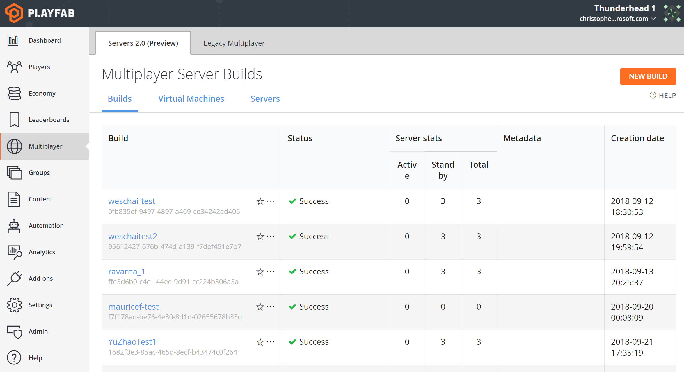
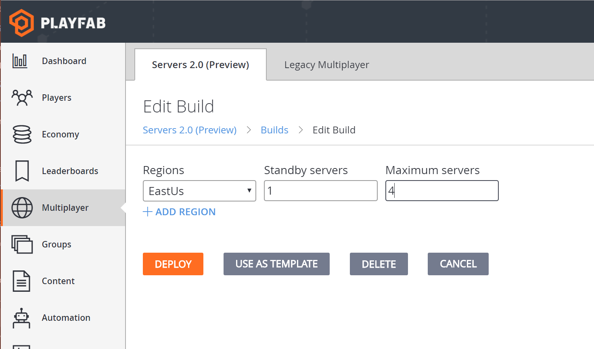

# Quickstart for multiplayer servers (API/PowerShell)

This tutorial helps you quickly upload a sample multiplayer server, configure a server build, and create server instances.

On a **Windows 10** PC, get the following pre-requisites ready:

- A PlayFab title ID, this needs to be a title that PlayFab has authorized for the private preview.
- A developer key for the title (See [Getting PlayFab Developer Keys](../../config/gamemanager/getting-playfab-developer-keys.md)).
- [Game Server SDK Sample - Windows Runner](https://github.com/PlayFab/gsdkSamples/releases/download/v1.0/winrunnerSample.zip)

## Install the PlayFab Multiplayer PowerShell module

1. Install the [PlayFab Multiplayer PowerShell module](https://www.powershellgallery.com/packages/PlayFabMultiplayer)

2. Open a **Windows PowerShell** window and run the commands shown below.

```powershell
Install-Module Azure.Storage
Install-Module PlayFabMultiplayer
```

3. You can learn more about the modules by running the following command.

```powershell
Get-Command -Module PlayFabMultiplayer| Get-Help
```

## Enable multiplayer servers for your title

In the **PowerShell** window, run the following command using your title ID and associated developer key:

```powershell
Get-PFTitleEntityToken -TitleID "mytitleID" -secretkey "mysecretkey"
```

This command uses the [PlayFab C# beta SDK](https://s3-us-west-2.amazonaws.com/api-playfab-com-craft-files/FileAssets/BetaSDKs-180827.zip) to call[GetEntityToken](xref:titleid.playfabapi.com.authentication.authentication.getentitytoken). Now let's [enable multiplayer servers](xref:titleid.playfabapi.com.multiplayer.multiplayerserver.enablemultiplayerserversfortitle) for the title:

```powershell
Enable-PFMultiplayerServer
```

## Upload a game server executable as an asset

We're going to use the *managed containers* option to create a build. With managed containers your game server build is created by uploading assets that are combined with a **Windows** container image. For this tutorial, upload the `winrunnerSample.zip` folder from the sample servers package you downloaded earlier

```powershell
Add-PFMultiplayerAsset -FilePath "C:\winrunnerSample.zip"
```

### Create a build

Now that the asset is uploaded, we can create a build.

```powershell  
$VMSelection = [PlayFab.MultiplayerModels.AzureVMSize]::Standard_D2_v2

$Ports = New-object PlayFab.MultiplayerModels.Port
$Ports.Name = "game_port"
$Ports.Num = 3600
$Ports.Protocol = [PlayFab.MultiplayerModels.ProtocolType]::TCP

New-PFMultiplayerBuild -BuildName "PowerShellTest" -AssetFileName "winrunnerSample.zip" -AssetMountPath "C:\Assets\" -StartMultiplayerServerCommand "C:\Assets\WindowsRunnerCSharp.exe" -MappedPorts $Ports -VMSize $VMSelection
```

In a few seconds we should see the build through the **PowerShell** or [ListBuildSummaries API](xref:titleid.playfabapi.com.multiplayer.multiplayerserver.listbuildsummaries), as shown below.

```powershell
Get-PFMultiplayerBuild -All
```

### Request a multiplayer server

Now that we've got a build, lets see standing by servers get created.

```powershell
Get-PFMultiplayerServer
```

Once we see some standing by servers, let's request one for gameplay...

```powershell
$Regions = new-object 'System.Collections.Generic.List[PlayFab.MultiplayerModels.AzureRegion]'
$Regions.Add("EastUS");

New-PFMultiplayerServer -BuildName "MyBuild" -SessionId "00000000-0000-0000-0000-000000000001" -SessionCookie "test cookie" -PreferredRegions $regions -BuildCerts $null
```

This is the core of PlayFab multiplayer servers: within 3 seconds of your matchmaking service calling [RequestMultiplayerServer](xref:titleid.playfabapi.com.multiplayer.multiplayerserver.requestmultiplayerserver) PlayFab will allocate a new server.

These servers come from continuously refilled, standing-by server pools you configure on a per-region and per-build basis. After gameplay ends the server is recycled.

### Configure regional settings

To tune the number of standing-by servers and regional allocation, the portal might be simpler to use than the **APIs**.

In Game Manager, you should see a **Multiplayer** tab and your builds listed under Servers 2.0, as shown below.



Select the title of a build to navigate to it's regional configuration, as seen here.



From this point you can add more regions, modify standing-by targets, and regional maximums.