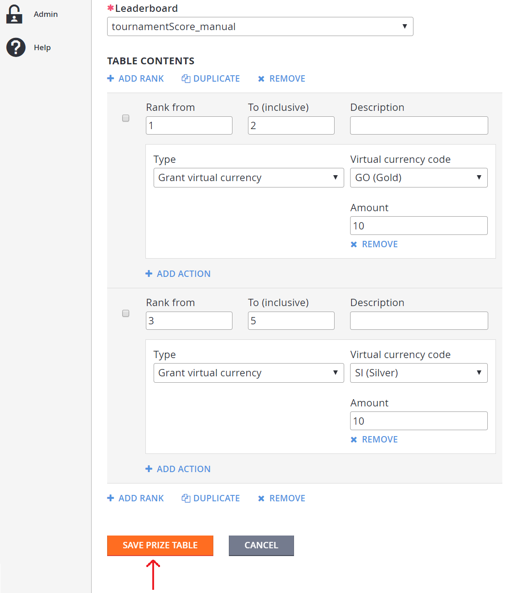
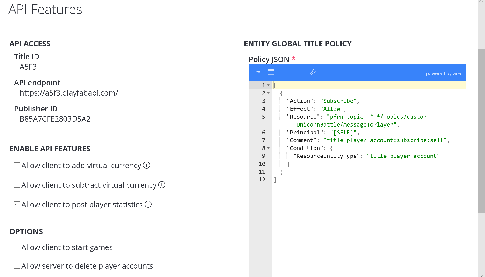
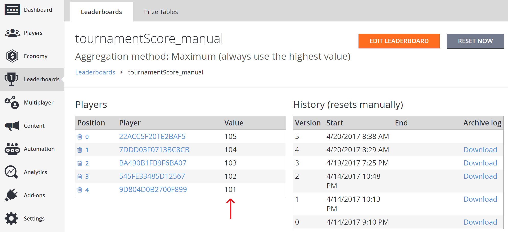
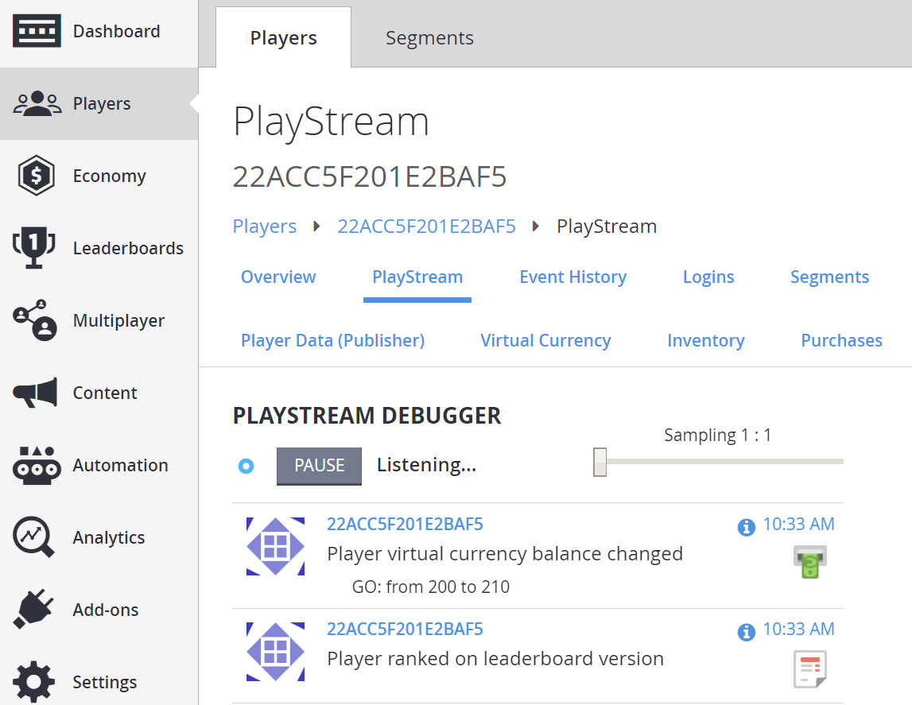
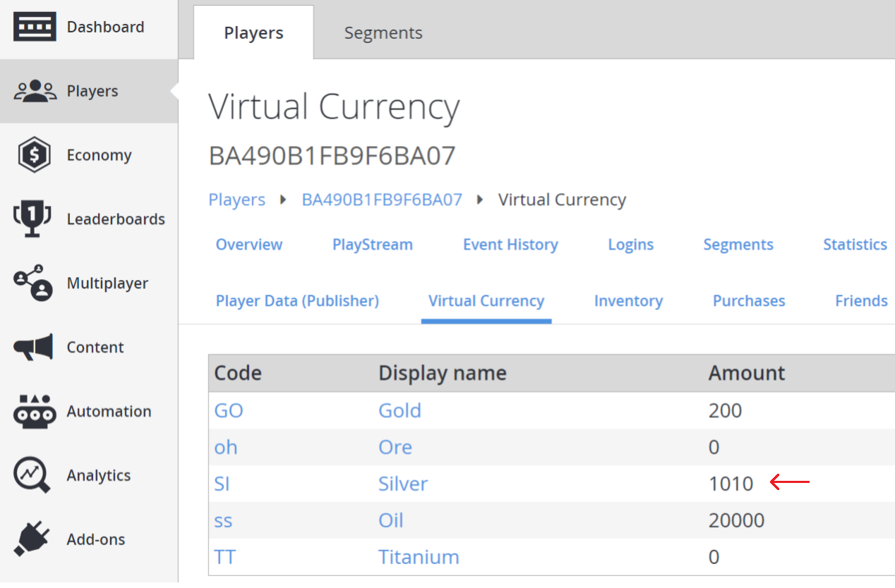

# Using Prize Tables

This tutorial walks you through how to create a Prize Table, that triggers a set of actions, on a group of players, within a range of ranks, in a [Resettable Leaderboard](using-resettable-statistics-and-leaderboards.md). In particular, this is a way to trigger emails, send push notifications, grant [Inventory Items](../../data/playerdata/player-inventory.md) and [Virtual Currency](../../commerce/economy/currencies.md), or execute a [CloudScript](../../automation/cloudscript/writing-custom-cloudscript.md) function at the reset of a Leaderboard. In this example, we show how to create the prize table “End Tournament Prizes” which grants virtual currency to 5 players based on their rank in a leaderboard after a reset is performed.

## Requirements

> [!IMPORTANT]
> This is an advanced tutorial. Please make sure that all requirements have been met or you will not be able to complete this tutorial.

- Basic knowledge of how to create a player will be necessary as there will need to be players in a leaderboard before it can perform any actions on those players. Refer to the [Getting Started with PlayFab - Chapter 1](../../config/dev-test-live/get-started-with-players-and-tournaments.md) tutorial which will run you through the process of creating a player for the title.
- It is also worthwhile to read the [Game Manager Quickstart](../../config/gamemanager/game-manager-quickstart.md) if you are unfamiliar with the Game Manager as it is the place where prize tables are created.
- In order to use Prize Tables, you must have general knowledge of how resettable leaderboards work. Please read about leaderboards in our tutorial [Using Resettable Statistics and Leaderboards](using-resettable-statistics-and-leaderboards.md).
- Additionally, a virtual currencies must be set up. Please read our tutorial about [Currencies](../../commerce/economy/currencies.md) and set up two currencies with the following parameters:
  1. Currency code: **GO**, Display name: **Gold**,  Initial deposit: **200**
  2. Currency code: **SI**, Display name: **Silver**, Initial deposit: **1000**

## Step 1 - Create a leaderboard

In the Game Manager, go to Leaderboards -> Leaderboards. Click NEW LEADERBOARD. Now add a leaderboard called “tournamentScore_manual” with a reset frequency of “Manually” and an aggregation method of “Maximum (always use the highest value)”.

  

## Step 2 - Create a prize table for the leaderboard

Now that a leaderboard has been created, a prize table can be associated with it. Go to Leaderboards -> Prize Tables, and click NEW PRIZE TABLE to be taken to the New Prize Table view.

  

In the New Prize Table view, name the new prize table “End Tournament Prizes” and choose “tournamentScore_manual” from the Leaderboard dropdown menu.

In order for this prize table to perform some action, ranks will need to be set. To do this click “+ ADD RANK” under the TABLE CONTENTS section, a rank form will appear.

  

In the rank form, make sure that the **Rank from** field has a value of “1” and **To (inclusive)** has a value of “2”. Then in the Type drop-down, choose “Grant virtual currency”. In the virtual currency code drop-down, choose “GO (Gold)” with an amount of “10”.

  

Now, we’ll add a second rank range. Click “+ADD RANK” under the TABLE CONTENTS section (there is also a second one at the bottom, that also works). In the rank form that appears, make sure that the **Rank from** field has a value of “3” and the **To (inclusive)** field has a value of “5”. In the Virtual currency code drop-down, choose “SI (Silver)” with an amount of “10”.

  

## Step 3 - Populate the leaderboard with a player

A leaderboard and prize table associated with it has now been created. The next step is to populate the leaderboard with players. To create players we will be using [LoginWithCustomID](xref:titleid.playfabapi.com.client.authentication.loginwithcustomid) from [Getting Started with PlayFab - Chapter 1](../../config/dev-test-live/get-started-with-players-and-tournaments.md) and then we will use the players to populate the leaderboard with [UpdatePlayerStatistics](xref:titleid.playfabapi.com.client.playerdatamanagement.updateplayerstatistics).

Before we can use [UpdatePlayerStatistics](xref:titleid.playfabapi.com.client.playerdatamanagement.updateplayerstatistics), we must enable it in API Features. Go to Settings -> API Features. Check “Allow client to post player statistics” and click SAVE API FEATURES.

  

### C# Code Example

The following C# code example creates 5 players and logs them in using [LoginWithCustomID](xref:titleid.playfabapi.com.client.authentication.loginwithcustomid). It then populates the leaderboard created earlier "tournamentScore_manual" with the 5 players with values 105, 104, 103, 102, and 101 using [UpdatePlayerStatistics](xref:titleid.playfabapi.com.client.playerdatamanagement.updateplayerstatistics).

```csharp
// Note: This is a recursive function. Invoke it initially with no parameter
public void CreatePlayerAndPopulateLeaderboard(int playerIndex = 5) {
    if (playerIndex <= 0) return;
    const string leaderboardName = "tournamentScore_manual";
    PlayFabClientAPI.LoginWithCustomID(new LoginWithCustomIDRequest {
        CustomId = playerIndex.ToString(),
        CreateAccount = true
    }, result => OnLoggedIn(result,playerIndex,leaderboardName), FailureCallback);
}

private void OnLoggedIn(LoginResult loginResult, int playerIndex, string leaderboardName) {
    Debug.Log("Player has successfully logged in with " + loginResult.PlayFabId);
    PlayFabClientAPI.UpdatePlayerStatistics(new UpdatePlayerStatisticsRequest {
        Statistics = new List<StatisticUpdate> {
            new StatisticUpdate {
                StatisticName = leaderboardName,
                Value = playerIndex + 100
            }
        }
    }, result=> OnStatisticsUpdated(result,playerIndex), FailureCallback);
}

private void OnStatisticsUpdated(UpdatePlayerStatisticsResult updateResult, int playerIndex) {
    Debug.Log("Successfully updated player statistic");
    // Recursively invoke for next player
    CreatePlayerAndPopulateLeaderboard(playerIndex - 1);
}

private void FailureCallback(PlayFabError error){
    Debug.LogWarning("Something went wrong with your API call. Here's some debug information:");
    Debug.LogError(error.GenerateErrorReport());
}
```

### Check results of the C# code example

To check that there are 5 players populated in the leaderboard with the correct values, go to Leaderboards -> Leaderboards to go back to the leaderboards list view. Click on “tournamentScore_manual” and there should be 5 players with the values 105, 104, 103, 102, and 101.

  

## Step 4 - Check player’s initial currencies

Before checking anything, go back to the test players from step 2. Go to Players and find a player that was put into “tournamentScore_manual” leaderboard in step 3. Click on the player ID and the Virtual Currency tab for that player record the values of the GO (Gold) and SI (Silver) currencies for that player.

Now do this for the remaining 4 of the 5 players that were put in the “tournamentScore_manual” leaderboard in step 3 making sure to record the values of their GO (Gold) and SI (Silver) currencies. These will be important for confirmation that the Prize Table worked after resetting.

  

## Step 5 - Reset the Leaderboard to grant rewards

Now go to Leaderboards -> Leaderboards to go back to the leaderboards list view. Click on “tournamentScore_manual”. Make note of the positions of the players on the leaderboard. These are zero indexed, so position 0 will be first place.

Click RESET NOW and click RESET to confirm the reset of the leaderboard. This will clear the Players list.


## Step 6 - Test that the Prize Table works

To see if the prize table worked, the players in the leaderboard can be checked to see if they were granted the correct amounts of currency. This can be quickly seen in a player's PlayStream debugger.

To see this in the PlayStream Debugger, go to Players -> PlayStream. This will show a player ranking on a leaderboard event followed by a virtual currency update.



Now, let's manually check if the players got the correct currencies. Go to Players -> Virtual Currency and make sure that the currency was granted correctly. This should be one more than the amount recorded earlier. Notice that players in leaderboard positions 0 or 1 gained 10 gold with no silver being awarded. Meanwhile, players in positions 2,3, and 4 were granted 10 silver and no gold. This matches the actions set up for the Prize Table.




Another way of checking that the virtual currency was granted correctly is to go into Players -> Event History. This will show a player_virtual_currency_balance_changed event with specific details on amounts that changed for the virtual currency granted.


