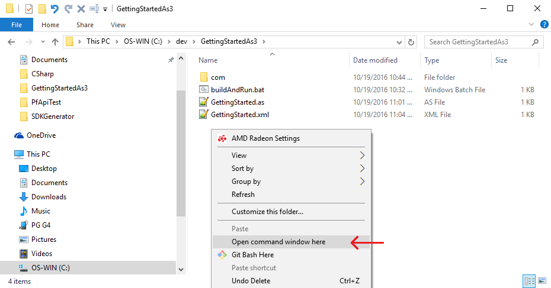
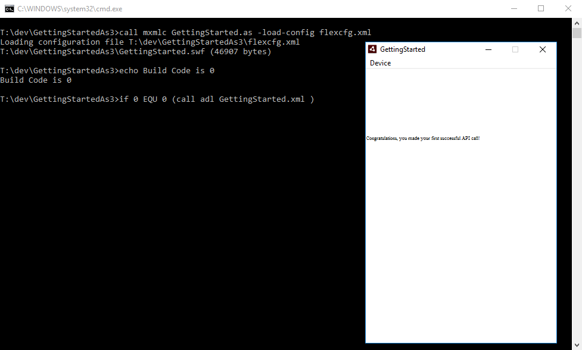

# ActionScript Quickstart for Flash

This guide will help you make your first PlayFab API call using ActionScript.

## ActionScript3 Project Setup 
- OS: This guide is for Windows 10
  - The steps for Mac should be similar, but probably not identical (Good luck!)

- Installation
  - These steps describe building an AS3 project using entirely free tools. As such, this might be more complicated than something like Adobe Flash Builder
    - These instructions are the result of lots of experimentation and testing, rather than expert knowledge
    - If you're already aware of simpler installation steps, feel free to skip to the next section

  - Downloads:
    - For environment variable instructions below, anything in {curly braces} should be replaced with the actual installation path (don't put actual curly braces in your environment variables)
    - Install the Adobe Air SDK
      - [https://www.adobe.com/devnet/air/air-sdk-download.html](https://www.adobe.com/devnet/air/air-sdk-download.html)
      - Remember your installation path {AirSdkLocation}, as you will use it below

    - Install the Adobe Flex SDK
      - [https://www.adobe.com/devnet/flex/flex-sdk-download.html](https://www.adobe.com/devnet/flex/flex-sdk-download.html) 
      - Remember your installation path {FlexSdkLocation}, and modify your system environment variables:
        - Add {FlexSdkLocation}/bin to your PATH environment variable
          - For example, if you install to C:/dev/flex_sdk_4.6, then set FLEX_HOME=C:/dev/flex_sdk_4.6
        - Add a FLEX_HOME system environment variable, and set it to {FlexSdkLocation}
          - For example, if you install to C:/dev/flex_sdk_4.6, then add C:/dev/flex_sdk_4.6/bin to your PATH

    - Copy/Paste the contents of {AirSdkLocation} over-top of {FlexSdkLocation}   
      - Open two Explorer windows: {AirSdkLocation} and {FlexSdkLocation} 
      - Select all in {AirSdkLocation} folder
      - Paste into the {FlexSdkLocation} folder
      - This will replace some existing files, and that's correct

    - Download the PlayFab ActionScriptSDK
      - [PlayFab ActionScriptSDK](https://api.playfab.com/sdks/download/actionscript)
      - Download the zip file, and extract it to a location of your choice {PlayFabAs3Location}

    - Updates to environment variables sometimes require a computer restart

  - Create a new empty folder for your GettingStartedAs3 Project
    - Create a new empty text file called GettingStarted.as
    - Create a new empty text file called GettingStarted.xml
    - Create a new empty text file called buildAndRun.bat

  - Import the PlayFab ActionScriptSDK into this project
    - In Windows-Explorer, navigate to {PlayFabAs3Location}/PfApiTest
    - Select the "com" folder, and copy it to your project folder
      - This contains a subfolder called "playfab" which is the PlayFabSDK

  - Create the flexcfg.xml file
    - Open a command window in your project folder
      - Hold shift and right click in the empty-white-space of the Explorer window

        

      - In the new console window enter this command:
        - mxmlc -dump-config flexcfg.xml

      - This should create a new text file called flexcfg.xml
    - We will modify all these project files in the next section

  - Installation complete!

## Set up your first API call   
This guide will provide the minimum steps to make your first PlayFab API call. Confirmation will be visible in the app.

In your favorite text-editor, update the contents of buildAndRun.bat as follows:

```cmd
call mxmlc GettingStarted.as -load-config flexcfg.xml
echo Build Code is %errorlevel%
if %errorlevel% EQU 0 (
   call adl GettingStarted.xml
)
pause
```

In your favorite text-editor, update the contents of GettingStarted.as as follows:

```as
package
{
    import flash.display.Sprite;
    import flash.text.*;
    import com.playfab.PlayFabSettings;
    import com.playfab.ClientModels.*;
    import com.playfab.PlayFabClientAPI;

    public class GettingStarted extends Sprite
    {
        public var textField:TextField;

        public function GettingStarted()
        {
            textField = new TextField();
            textField.x=0; textField.y=0; textField.width=2000; textField.height=2000;
            textField.text = "Login pending...";
            stage.addChild(textField);

            PlayFabSettings.TitleId = "144"; // Please change this value to your own titleId from PlayFab Game Manager

            var loginRequest:com.playfab.ClientModels.LoginWithCustomIDRequest = new com.playfab.ClientModels.LoginWithCustomIDRequest();
            loginRequest.TitleId = PlayFabSettings.TitleId;
            loginRequest.CustomId = "GettingStartedGuide";
            loginRequest.CreateAccount = true;
            PlayFabClientAPI.LoginWithCustomID(loginRequest, OnLoginSuccess, OnLoginFail);
        }

        private function OnLoginSuccess(result:com.playfab.ClientModels.LoginResult) : void
        {
            textField.text = "Congratulations, you made your first successful API call!";
        }

        private function OnLoginFail(error:com.playfab.PlayFabError) : void
        {
            var fullMessage:String = error.errorMessage;
            for (var key:String in error.errorDetails) {
                fullMessage += "\n";
                fullMessage += key + ": " + error.errorDetails[key];
            }
            textField.text = "Something went wrong with your first API call.\n" + 
                "Here's some debug information:\n" +
                fullMessage;
        }
    }
}
```

In your favorite text-editor, update the contents of GettingStarted.xml as follows:

```xml
<?xml version="1.0" encoding="UTF-8"?>
<application xmlns="http://ns.adobe.com/air/application/22.0">
    <id>samples.android.GettingStarted</id>
    <versionNumber>0.0.1</versionNumber>
    <filename>GettingStarted</filename>
    <initialWindow>
        <content>GettingStarted.swf</content>
    </initialWindow>
    <supportedProfiles>mobileDevice</supportedProfiles>
</application>
```

In your favorite text-editor, open flexcfg.xml and make the following changes:
  - flexcfg.xml is a large file, but we will only be making small changes 
  - The <external-library-path> and <library-path> sections need to be converted to absolute paths
    - Replace these two sections:

```xml
<external-library-path>
  <path-element>libs/player/{targetPlayerMajorVersion}.{targetPlayerMinorVersion}/playerglobal.swc</path-element>
</external-library-path>
...
<library-path>
  <path-element>libs</path-element>
  <path-element>locale/{locale}</path-element>
</library-path>
```

With absolute paths based on your FlexSdk installation
  - In my case, I installed Flex to C:/dev/flex_sdk_4.6/, so my replacements look like this:

```xml
<external-library-path>
  <path-element>C:/dev/flex_sdk_4.6/frameworks/libs/player/{targetPlayerMajorVersion}.{targetPlayerMinorVersion}/playerglobal.swc</path-element>
</external-library-path>
...
<library-path>
  <path-element>C:/dev/flex_sdk_4.6/frameworks/libs</path-element>
  <path-element>C:/dev/flex_sdk_4.6/frameworks/locale/{locale}</path-element>
</library-path>
```

## Finish and Execute

- In Windows explorer, double click buildAndRun.bat
  - After running, note the new file GettingStarted.swf - This our compiled project
- This will open two new windows, which collectively should look like this:

  

- At this point, you can start making other api calls, and building your game
- For a list of all available client API calls, see our [PlayFab API References](../../api-references/index.md) documentation.
  
- Happy coding!

## Deconstruct the code

This optional last section describes every file in the ActionScript3 Project in detail.
  - buildAndRun.bat
    - This file is a simple Windows batch file which compiles and executes this project
    - call mxmlc GettingStarted.as -load-config flexcfg.xml
      - mxmlc is the Flex compiler for ActionScript3
        - The rest is just telling the compiler what to do, specifically, build our GettingStarted.as project, and use the flexcfg.xml file as configuration settings  

    - errorlevel is an automatic Windows variable you can use to check whether the previous command succeeded
    - call adl GettingStarted.xml
      - adl is Air Debug Launcher, which launches a compiled swf file as a Windows app

  - GettingStarted.xml
    - This is a bare bones ActionScript project definition file. The first section of [this Adobe guide](https://help.adobe.com/en_US/air/build/WS901d38e593cd1bac25d3d8c712b2d86751e-8000.html) describes everything in detail:

  - flexcfg.xml
    - This file tells the mxmlc compiler all of the variables and settings it should use
    - We only made trivial changes from the default setting

  - GettingStarted.as
    - This file contains the only code relevant to the PlayFab SDK
    - textField:
      - These lines are just controlling the GUI output, displaying the results of the API call

    - PlayFabSettings.TitleId = "144";
      - Every PlayFab developer creates a title in Game Manager. When you publish your game, you must code that titleId into your game. This lets the client know how to access the correct data within PlayFab. For most users, just consider it a mandatory step that makes PlayFab work.

    - var loginRequest:com.playfab.ClientModels.LoginWithCustomIDRequest = new com.playfab.ClientModels.LoginWithCustomIDRequest();
      - Most PlayFab API methods require input parameters, and those input parameters are packed into a request object
      - Every API method requires a unique request object, with a mix of optional and mandatory parameters
        - For LoginWithCustomIDRequest, there is a mandatory parameter of CustomId, which uniquely identifies a player and CreateAccount, which allows the creation of a new account with this call.

      - For login, most developers will want to use a more appropriate login method
        - See the PlayFab Login documentation for a list of all login methods, and input parameters. Common choices are:
          - LoginWithAndroidDeviceID
          - LoginWithIOSDeviceID
          - LoginWithEmailAddress

    - PlayFabClientAPI.LoginWithCustomID(loginRequest, OnLoginSuccess, OnLoginFail);
      - This begins the async request to "LoginWithCustomID". When complete, it will call OnLoginSuccess or OnLoginFail for success or failure respectively

    - Inside of OnLoginSuccess:
      - The result object of many API success callbacks will contain the requested information
      - LoginResult contains some basic information about the player, but for most users, login is simply a mandatory step before calling other APIs.

    - Inside of OnLoginFailure:
      - API calls can fail for many reasons, and you should always attempt to handle failure
      - Why API calls fail (In order of likelihood)
        - PlayFabSettings.TitleId is not set. If you forget to set titleId to your title, then nothing will work.
        - Request parameters. If you have not provided the correct or required information for a particular API method, then it will fail. See error.errorMessage, error.errorDetails for more info.
        - Device connectivity issue. Cell-phones lose/regain connectivity constantly, and so any API call at any time can fail randomly, and then work immediately after. Going into a tunnel can disconnect you completely.
        - PlayFab server issue. As with all software, there can be issues. See our [release notes](../../release-notes/index.md) for updates.
        - The internet is not 100% reliable. Sometimes the message is corrupted or fails to reach the PlayFab server.
      - If you are having difficulty debugging an issue, and the information within the error callback is not sufficient, please visit us on our [forums](https://community.playfab.com/index.html)
