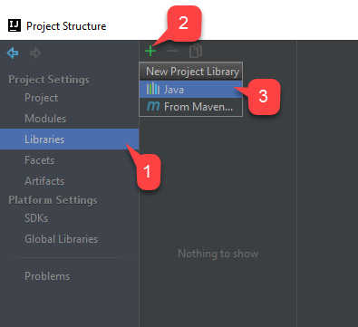
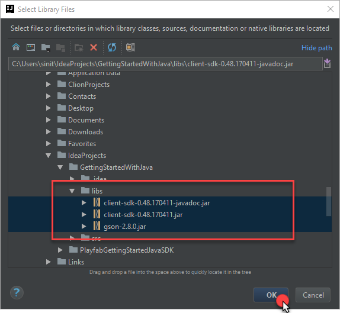
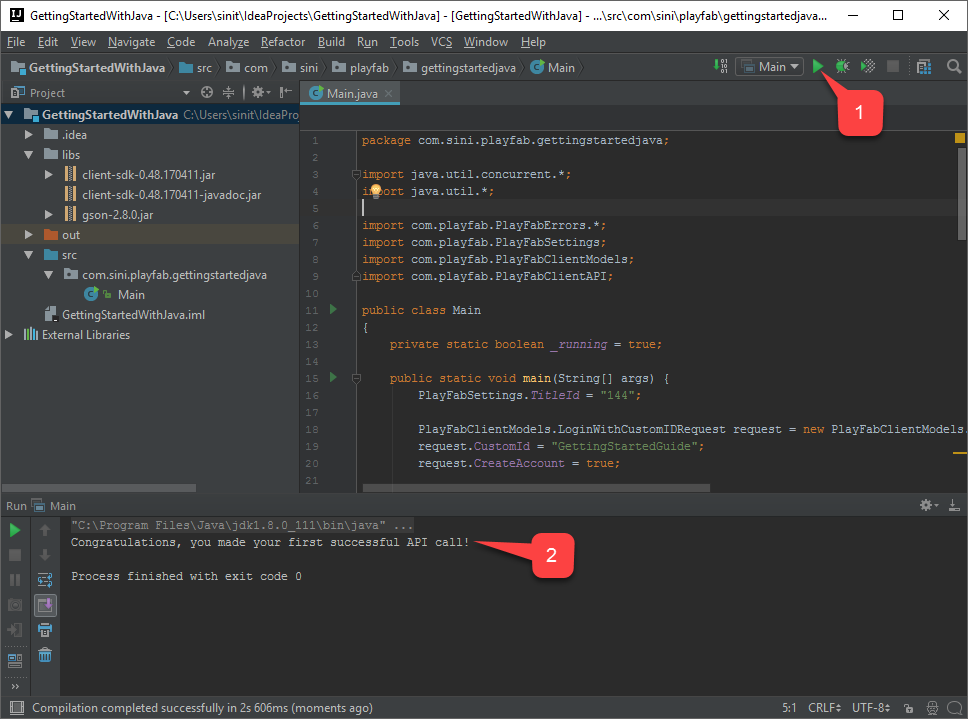

# Java quickstart for Native and Android Studio

This tutorial lets you get up and running with the PlayFab JavaSDK and simple Java program.

Before continuing, make sure you have completed [Getting started for developers](../../personas/developer.md) which ensures you have a PlayFab account and are familiar with the PlayFab Game Manager.

The goals for this tutorial are:  

- Acquire necessary JAR files.

- Add JAR files to the classpath.

- Create minimal Java console application that executes [Custom ID Login API Call](xref:titleid.playfabapi.com.client.authentication.loginwithcustomid).

## Acquire necessary JAR files

In order to utilize the PlayFab JavaSDK, we need the PlayFab Client JavaSDK and its dependency, the Google GSON.

Download the PlayFab Client JavaSDK JAR library [here](https://github.com/PlayFab/JavaSDK/tree/versioned/builds). Look for **client-sdk-*.jar**, and the corresponding Java Doc [Optional but useful].

You may download latest Google GSON [here](https://repo1.maven.org/maven2/com/google/code/gson/gson/2.8.0/). Look for **gson-*.jar**.

## Project Setup with Intellij Idea

Once you have initialized a simple Intellij Idea Java Project, make sure to place the necessary JAR files as shown in the following example.


The next step is adding JAR files to the classpath. Navigate to **File** -> **,** as shown in the example below.


Navigate to **Libraries**, and add a new Java library as illustrated in the image provided below.



Select the JAR files you added to the libs folder, then select **OK** as shown below.



If asked for the **Module**, select the first one in the list. Ensure that all the JAR files were added to the libraries list.


## Project Setup with any IDE

The main requirement is to have JAR files added to the classpath. Please consult the guide for your IDE on how to add JAR files to classpath.

## Set up your first API call

Use the code shown below as your main class code.

```java
import java.util.concurrent.*;
import java.util.*;

import com.playfab.PlayFabErrors.*;
import com.playfab.PlayFabSettings;
import com.playfab.PlayFabClientModels;
import com.playfab.PlayFabClientAPI;

public class Main
{
    private static boolean _running = true;

    public static void main(String[] args) {
        PlayFabSettings.TitleId = "144";

        PlayFabClientModels.LoginWithCustomIDRequest request = new PlayFabClientModels.LoginWithCustomIDRequest();
        request.CustomId = "GettingStartedGuide";
        request.CreateAccount = true;

        FutureTask<PlayFabResult<com.playfab.PlayFabClientModels.LoginResult>> loginTask = PlayFabClientAPI.LoginWithCustomIDAsync(request);
        loginTask.run();

        while (_running) {
            if (loginTask.isDone()) { // You would probably want a more sophisticated way of tracking pending async API calls in a real game
                OnLoginComplete(loginTask);
            }

            // Presumably this would be your main game loop, doing other things
            try {
                Thread.sleep(1);
            } catch(Exception e) {
                System.out.println("Critical error in the example main loop: " + e);
            }
        }
    }

    private static void OnLoginComplete(FutureTask<PlayFabResult<com.playfab.PlayFabClientModels.LoginResult>> loginTask) {
        PlayFabResult<com.playfab.PlayFabClientModels.LoginResult> result = null;
        try {
            result = loginTask.get(); // Wait for the result from the async call
        } catch(Exception e) {
            System.out.println("Exception in PlayFab api call: " + e); // Did you assign your PlayFabSettings.TitleId correctly?
        }

        if (result != null && result.Result != null) {
            System.out.println("Congratulations, you made your first successful API call!");
        } else if (result != null && result.Error != null) {
            System.out.println("Something went wrong with your first API call.");
            System.out.println("Here's some debug information:");
            System.out.println(CompileErrorsFromResult(result));
        }

        _running = false; // Because this is just an example, successful login triggers the end of the program
    }

    // This is a utility function we haven't put into the core SDK yet. Feel free to use it.
    private static <RT> String CompileErrorsFromResult(PlayFabResult<RT> result) {
        if (result == null || result.Error == null)
            return null;

        String errorMessage = "";
        if (result.Error.errorMessage != null)
            errorMessage += result.Error.errorMessage;
        if (result.Error.errorDetails != null)
            for (Map.Entry<String, List<String>> pair : result.Error.errorDetails.entrySet() )
                for (String msg : pair.getValue())
                    errorMessage += "\n" + pair.getKey() + ": " + msg;
        return errorMessage;
    }
}
```

## Finish and Execute

To run the application:

1. Select the **play arrow >** in the top right corner. This will start program execution, and output panel will appear.
2. Locate the **debug message**. This indicates that API call was successful.



At this point, you can start making other API calls, and building your game.

For a list of all available client API calls, see our [PlayFab API References](../../api-references/index.md) documentation.

## Deconstruct the code

This optional last section describes every line in `GettingStarted.java` in detail.

- Imports
  - This is the minimal set of imports used to make PlayFab API calls.

- public static void `main(String[] args) {`
  - Just a basic loop that kicks off an API call, and waits for it to complete.
  - `PlayFabSettings.TitleId = "xxxx"`;
    - Every PlayFab developer creates a title in Game Manager. When you publish your game, you must code that titleId into your game. This lets the client know how to access the correct data within PlayFab. For most users, just consider it a mandatory step that makes PlayFab work.

  - `PlayFabClientModels.LoginWithCustomIDRequest request = new PlayFabClientModels.LoginWithCustomIDRequest();`
    - Most PlayFab API methods require input parameters, and those input parameters are packed into a request object.
    - Every API method requires a unique request object, with a mix of optional and mandatory parameters.
      - For `LoginWithCustomIDRequest`, there is a mandatory parameter of `CustomId`, which uniquely identifies a player and `CreateAccount`, which allows the creation of a new account with this call.

    - For login, most developers will want to use a more appropriate login method.
      - See the PlayFab Login documentation for a list of all login methods, and input parameters. Common choices are:
        - `LoginWithAndroidDeviceID`
        - `LoginWithIOSDeviceID`
        - `LoginWithEmailAddress`

  - `FutureTask<PlayFabResult<com.playfab.PlayFabClientModels.LoginResult>> loginTask = PlayFabClientAPI.LoginWithCustomIDAsync(request)`;
    - This begins the async request to `LoginWithCustomID`, using the Java FutureTask framework.

  - While (running) `{ if (loginTask.isDone()) { OnLoginComplete(loginTask); } }`
    - Run a trivial main loop, and asynchronously wait for the loginTask to complete.
    - When finished call `OnLoginComplete`.

- `OnLoginComplete (loginTask)`
  - `result = loginTask.get()`;
    - Fetch the async result (this won't cause a block, because we confirmed the FutureTask is already complete.

  - if (`result.Result != null`), then the API call was successful.
    - When successful, the `result.Result` object of many API callbacks will contain the requested information.

    - `LoginResult` specifically contains some basic information about the player.  But for most users, login is simply a mandatory step before calling other APIs.
  - If (`result.Error != null`), the API call has failed.
    - API calls can fail for many reasons, and you should always attempt to handle failure.
    - Why API calls fail (In order of likelihood)
      - `PlayFabSettings.TitleId` is not set. If you forget to set `TitleId` to your title, then nothing will work.
      - Request parameters. If you have not provided the correct or required information for a particular API call, then it will fail. See `error.errorMessage`, `error.errorDetails`, or `error.GenerateErrorReport()` for more info.
      - Device connectivity issue. Cell phones lose/regain connectivity constantly, and so any API call at any time can fail randomly, and then work immediately after. Going into a tunnel can disconnect you completely.
      - PlayFab server issue. As with all software, there can be issues. See our [release notes](../../release-notes/index.md) for updates.
      - The internet is not 100% reliable. Sometimes the message is corrupted, or fails to reach the PlayFab server.

  - If you are having difficulty debugging an issue, and the information within the error information is not sufficient, please visit us on our [forums](https://community.playfab.com/index.html).
