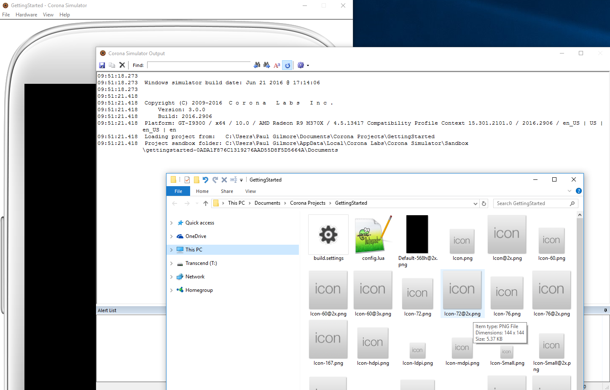
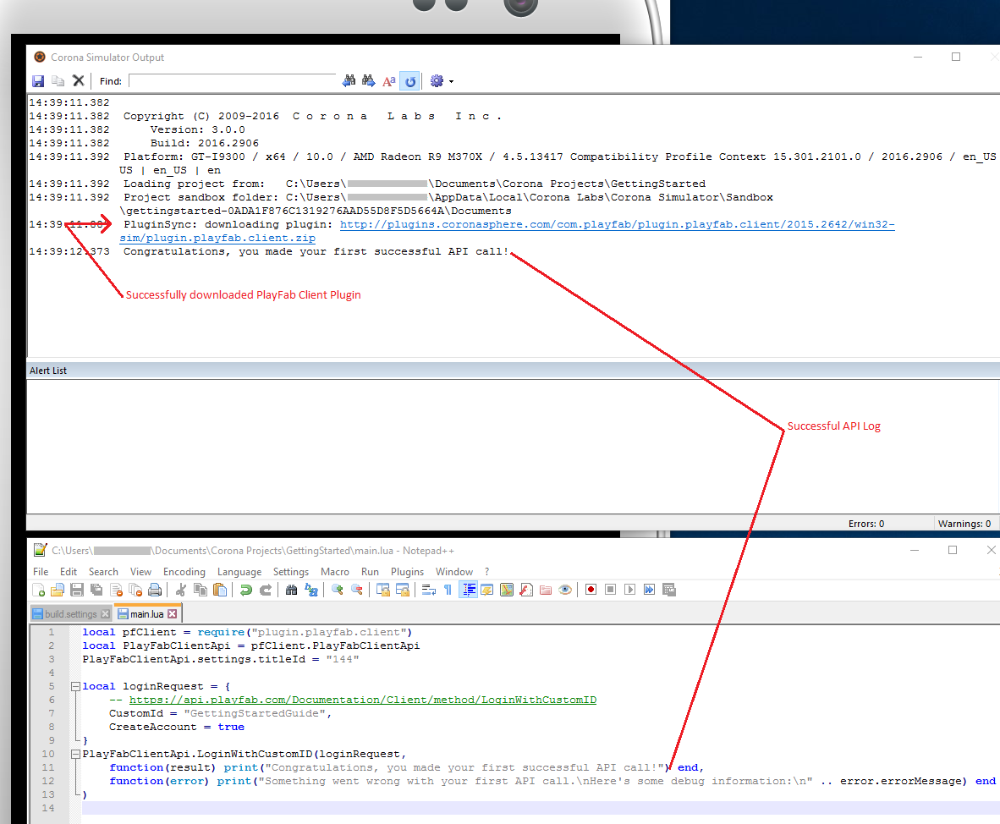

# Lua quickstart for Corona

This guide will help you make your first PlayFab API call in the Corona engine.

Before continuing, make sure you have completed [Getting started for developers](../../personas/developer.md) which ensures you have a PlayFab account and are familiar with the PlayFab Game Manager.

## Corona Project Setup 

OS: This guide is written for Windows 10, however it should also work fine with a Mac.

1. Download and install Corona.

    - [https://coronalabs.com/](https://coronalabs.com/)

2. Run Corona, and create a new project.

The following guide will help you through the first-time steps if you haven't already done them:

- [https://docs.coronalabs.com/guide/start/installWin/index.html](https://docs.coronalabs.com/guide/start/installWin/index.html)

Once you've installed, logged in, and created a new project, you should see several windows that look something like this:

    

3. Activate the PlayFab Client plugin on the Corona Marketplace.

    - [https://marketplace.coronalabs.com/plugin/playfab-client](https://marketplace.coronalabs.com/plugin/playfab-client)
  
The PlayFab installation is complete!

## Setting up your first API call

This guide provides the minimum steps to make your first PlayFab API call. Confirmation is visible in the Corona Engine output log. 

In your favorite text-editor, ADD the lines shown in the following screen shot to **build.settings.**

```lua
settings =
{
    -- ADD THESE THREE LINES at the top, leave everything else as-is
    plugins = {
        ["plugin.playfab.client"] = { publisherId = "com.playfab" }
    },

-- Other existing lines...
}
```

> [!NOTE]
> To look up the correct format for the loginRequest object in this example, see the API reference for [LoginWithCustomID](xref:titleid.playfabapi.com.client.authentication.loginwithcustomid).

In your favorite text-editor, REPLACE the contents of the **main.lua** file with the contents shown below.

```lua
local pfClient = require("plugin.playfab.client")
local PlayFabClientApi = pfClient.PlayFabClientApi
PlayFabClientApi.settings.titleId = "144"

local loginRequest = {
    -- See the API reference for LoginWithCustomID.
    CustomId = "GettingStartedGuide",
    CreateAccount = true
}
PlayFabClientApi.LoginWithCustomID(loginRequest,
    function(result) print("Congratulations, you made your first successful API call!") end,
    function(error) print("Something went wrong with your first API call.\nHere's some debug information:\n" .. error.errorMessage) end
)
```

## Finish and execute

Corona automatically executes the project source immediately when you save. So, as soon as you update and save these two files, you should see this:



At this point, you can start making other API calls, and building your game. For a list of all available client API calls, see our [PlayFab API References](../../api-references/index.md) documentation.

Happy coding!

## Deconstruct the code

This optional last section describes each part of our example above, line-by-line.

- build.settings
  - `plugins = {`
    - This invokes the Corona plugin system, and tells it to download and install Corona Marketplace plugins in your project
  - `["plugin.playfab.client"] = { publisherId = "com.playfab" }`
    - This tells it to download the PlayFab Client plugin specifically.
- main.lua
  - require() lines:
    - This is the minimal imports you need to make PlayFab API calls.
  - `PlayFabClientApi.settings.titleId = "xxxx"`
    - Every PlayFab developer creates a title in Game Manager. When you publish your game, you must code that titleId into your game. This lets the client know how to access the correct data within PlayFab. For most users, just consider it a mandatory step that makes PlayFab work.
  - `local loginRequest = { CustomId = "GettingStartedGuide", CreateAccount = true }`
    - Most PlayFab API methods require input parameters, and those input parameters are packed into a request object
    - Every API method requires a unique request object, with a mix of optional and mandatory parameters
      - For `LoginWithCustomIDRequest`, there is a mandatory parameter of CustomId, which uniquely identifies a player and CreateAccount, which allows the creation of a new account with this call.
  - `PlayFabClientApi.LoginWithCustomID(loginRequest, {OnLoginSuccess-function}, {OnLoginError-function})`
    - This begins the async request to "LoginWithCustomID", which will call the first (OnLoginSuccess) callback if successful, or the second (OnLoginError) function for failures
  - For login, most developers will want to use a more appropriate login method
    - See the [PlayFab Login documentation](xref:titleid.playfabapi.com.client.authentication) for a list of all login methods, and input parameters. Common choices are:
      - [LoginWithAndroidDeviceID](xref:titleid.playfabapi.com.client.authentication.loginwithandroiddeviceid)
      - [LoginWithIOSDeviceID](xref:titleid.playfabapi.com.client.authentication.loginwithiosdeviceid)
      - [LoginWithEmailAddress](xref:titleid.playfabapi.com.client.authentication.loginwithemailaddress)
    - `OnLoginSuccess` is any function which accepts a single parameter (result)
      - The result object will contain the requested information, according to the API called
      - LoginResult contains some basic information about the player, but for most users, login is simply a mandatory step before calling other APIs
    - `OnLoginError` is any function which accepts a single parameter (error)
      - API calls can fail for many reasons, and you should always attempt to handle failure
      - Why API calls fail (In order of likelihood).
        - PlayFabSettings.TitleId is not set. If you forget to set titleId to your title, then nothing will work.
        - Request parameters. If you have not provided the correct or required information for a particular API call, then it will fail. See error.errorMessage, error.errorDetails, or error.GenerateErrorReport() for more info.
        - Device connectivity issue. Cell-phones lose/regain connectivity constantly, and so any API call at any time can fail randomly, and then work immediately after. Going into a tunnel can disconnect you completely.
        - PlayFab server issue. As with all software, there can be issues. See our [release notes](../../release-notes/index.md) for updates.
        - The internet is not 100% reliable. Sometimes the message is corrupted or fails to reach the PlayFab server.
      - If you are having difficulty debugging an issue, and the information within the error information is not sufficient, please visit us on our [forums](https://community.playfab.com/index.html)
