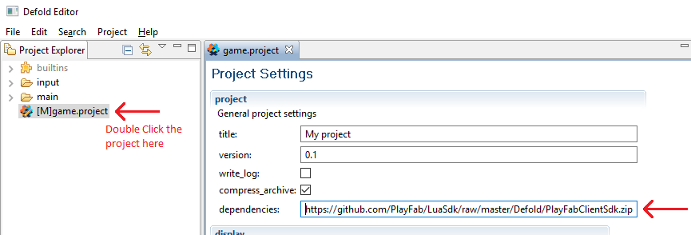
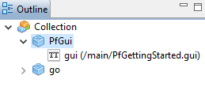

# Lua Quickstart for Defold

This guide will help you make your first PlayFab API call using Defold.

## Defold Project Setup

- OS: This guide is written for Windows 10, however it should also work fine with a Mac
- Download Defold
  - Create an account, or log in at [https://www.defold.com/](https://www.defold.com/) (Uses Google O-Auth)
  - Download and install Defold
    - [https://d.defold.com/stable/](https://d.defold.com/stable/)

  - Create a new project on the Defold Dashboard
    - After logging in, you should find yourself at the Defold dashboard
    - If you have not completed the Defold "Getting Started Tutorial", you should do that now
    - Finally create a new project in the Defold web Dashboard

      

  - Run Defold, and load your new project
  - You should see several windows that look something like this:

    

  - Update the Project Settings, and include PlayFab in the dependencies
    - dependencies: [https://github.com/PlayFab/LuaSdk/raw/master/Defold/PlayFabClientSdk.zip](https://github.com/PlayFab/LuaSdk/raw/master/Defold/PlayFabClientSdk.zip)

      

    - Click: Project -> Fetch Libraries, and you should see a new builtin "PlayFab" folder:

      

  - Create a few files:
    - main/PfGettingStarted.gui
      - right-click "main" folder -> new -> Gui File -> PfGettingStarted.gui

    - main/PfGettingStarted.gui_script
      - right-click "main" folder -> new -> Gui Script File -> PfGettingStarted.gui_script

  - Finally, hook up our new gui in the main.collection
    - Double click main.collection to open it
    - In the Outline panel:
      - Right-Click, Add Game Object (Optionally rename to PfGui)
        - Right-Click the new object, Add Component From File...
          - PfGettingStarted.gui (Created above)

    - The Outline panel viewing main.collection should look like this:

      

- PlayFab installation complete
  - This project isn't ready to build yet, but we'll fix that in the next step

## Set up your first API call

This guide will provide the minimum steps make your first PlayFab API call. Confirmation will be visible in the game window.

- In the Defold editor, double-click PfGettingStarted.gui_script
  - This should open the file for text editing
  - Update the contents of PfGettingStarted.gui_script as follows:

> [!NOTE]
> To look up the correct format for the loginRequest object in this example, see the API reference for [LoginWithCustomID](xref:titleid.playfabapi.com.client.authentication.loginwithcustomid).

```gui_script
local PlayFabClientApi = require("PlayFab.PlayFabClientApi")
local IPlayFabHttps = require("PlayFab.IPlayFabHttps")
local PlayFabHttps_Defold = require("PlayFab.PlayFabHttps_Defold")
IPlayFabHttps.SetHttp(PlayFabHttps_Defold) -- Assign the Defold-specific IHttps wrapper

PlayFabClientApi.settings.titleId = "144" -- Please change this value to your own titleId from PlayFab Game Manager

function init(self)
    local loginRequest = {
        -- See the API reference for LoginWithCustomID
        TitleId = PlayFabClientApi.settings.titleId,
        CustomId = "GettingStartedGuide",
        CreateAccount = true
    }
    PlayFabClientApi.LoginWithCustomID(loginRequest, OnLoginSuccess, OnLoginFailed)
end

function OnLoginSuccess(result)
    local pfTestOutput = gui.get_node("pfOutput")
    gui.set_text(pfTestOutput, "Congratulations, you made your first successful API call!")
end

function OnLoginFailed(error)
    local pfTestOutput = gui.get_node("pfOutput")
    local message = "Something went wrong with your first API call.\n"
    local message = message .. "Here's some debug information:\n"
    local message = message .. error.GenerateErrorReport()
    gui.set_text(pfTestOutput, message)
end
```

- In the Defold editor, right-click PfGettingStarted.gui -> Open With -> Text Editor
  - Unfortunately, this changes an internal setting in Defold, so:
    - Open it again: right-click PfGettingStarted.gui -> Open With -> Gui Editor
    - This resets the default back to normal

  - Click the text-edit tab for PfGettingStarted.gui
  - Update the text contents of PfGettingStarted.gui as follows:

```gui_script
script: "/main/PfGettingStarted.gui_script"
fonts {
  name: "system_font"
  font: "/builtins/fonts/system_font.font"
}
background_color {
  x: 0.0
  y: 0.0
  z: 0.0
  w: 1.0
}
nodes {
  position {
    x: 100.0
    y: 620.0
    z: 0.0
    w: 1.0
  }
  rotation {
    x: 0.0
    y: 0.0
    z: 0.0
    w: 1.0
  }
  scale {
    x: 1.0
    y: 1.0
    z: 1.0
    w: 1.0
  }
  size {
    x: 1080.0
    y: 520.0
    z: 0.0
    w: 1.0
  }
  color {
    x: 1.0
    y: 1.0
    z: 1.0
    w: 1.0
  }
  type: TYPE_TEXT
  blend_mode: BLEND_MODE_ADD
  text: "Logging in..."
  font: "system_font"
  id: "pfOutput"
  xanchor: XANCHOR_LEFT
  yanchor: YANCHOR_TOP
  pivot: PIVOT_NW
  outline {
    x: 1.0
    y: 1.0
    z: 1.0
    w: 1.0
  }
  shadow {
    x: 1.0
    y: 1.0
    z: 1.0
    w: 1.0
  }
  adjust_mode: ADJUST_MODE_FIT
  line_break: false
  layer: ""
  inherit_alpha: true
  clipping_mode: CLIPPING_MODE_NONE
  clipping_visible: true
  clipping_inverted: false
  alpha: 1.0
  outline_alpha: 1.0
  shadow_alpha: 1.0
  template_node_child: false
  text_leading: 1.0
  text_tracking: 0.0
  size_mode: SIZE_MODE_AUTO
}
material: "/builtins/materials/gui.material"
adjust_reference: ADJUST_REFERENCE_PARENT
max_nodes: 512
```

## Finish and Execute

- Make sure everything is saved
  - Click another tab, and look for " * " markers - sometimes Defold doesn't refresh
  - Save everything

- Build your game
  - Ctrl+b or dropdowns: Project -> Build and Launch

- You should see the following text on your screen:
  - Congratulations, you made your first successful API call!

- At this point, you can start making other api calls, and building your game
  - For a list of all available client API calls, see our [PlayFab API References](../../api-references/index.md) documentation.

- Happy coding!

## Deconstruct the code

- PfGettingStarted.gui
  - Our instructions for PfGettingStarted.gui are for expediency, not instruction. This file is a gui definition, which adds a text box to the screen, binds it to our other script: PfGettingStarted.gui_script. You would NOT typically edit these files in text-form.
  - For proper instructions on how to build Defold GUI widgets, please read this guide:
  - [GUI scenes in Defold](https://www.defold.com/manuals/gui/)

- PfGettingStarted.gui_script
  - Require statements and setup
    - PlayFabClientApi allows you to make Client API calls - This is why you're here
    - IPlayFabHttps and PlayFabHttps_Defold:
      - The PlayFab Defold plugins are built on the PlayFab LuaSdk. The Lua language does not have a proper HTTPS module. Each game-engine that uses Lua implements their own. These two variables tell PlayFabSdk how to access HTTPS. You only need to do this once in your project, in the first scene. Otherwise it's just required boilerplate

  - PlayFabClientApi.settings.titleId = "144"
    - Every project using PlayFab should create a unique title in the PlayFab website, which we call Game Manager. Find your titleId in game manager, and replace 144 with your titleId

  - function init(self)
    - Defold function - This is called when the gui is initialized

  - local loginRequest = { TitleId = PlayFabClientApi.settings.titleId, CustomId = "GettingStartedGuide", CreateAccount = true }
    - Most PlayFab API methods require input parameters, and those input parameters are packed into a request object
    - Every API method requires a unique request object, with a mix of optional and mandatory parameters
      - For LoginWithCustomIDRequest, there is a mandatory parameter of CustomId, which uniquely identifies a player and CreateAccount, which allows the creation of a new account with this call.
    - For login, most developers will want to use a more appropriate login method
      - See the [PlayFab Login documentation](xref:titleid.playfabapi.com.client.authentication) for a list of all login methods, and input parameters. Common choices are:
        - [LoginWithAndroidDeviceID](xref:titleid.playfabapi.com.client.authentication.loginwithandroiddeviceid)
        - [LoginWithIOSDeviceID](xref:titleid.playfabapi.com.client.authentication.loginwithiosdeviceid)
        - [LoginWithEmailAddress](xref:titleid.playfabapi.com.client.authentication.loginwithemailaddress)

  - PlayFabClientApi.LoginWithCustomID(loginRequest, OnLoginSuccess, OnLoginFailed)
    - This performs the API call using the request, and provides callback functions for success and fail conditions

  - function OnLoginSuccess(result)
    - The result object of many API success callbacks will contain the requested information
    - LoginResult contains some basic information about the player, but for most users, login is simply a mandatory step before calling other APIs.

  - function OnLoginFailed(error)
    - API calls can fail for many reasons, and you should always attempt to handle failure
    - Why API calls fail (In order of likelihood)
      - PlayFabSettings.TitleId is not set. If you forget to set titleId to your title, then nothing will work.
      - Request parameters. If you have not provided the correct or required information for a particular API call, then it will fail. See error.errorMessage, error.errorDetails, or error.GenerateErrorReport() for more info.
      - Device connectivity issue. Cell-phones lose/regain connectivity constantly, and so any API call at any time can fail randomly, and then work immediately after. Going into a tunnel can disconnect you completely.
      - PlayFab server issue. As with all software, there can be issues. See our [release notes](../../release-notes/index.md) for updates.
      - The internet is not 100% reliable. Sometimes the message is corrupted or fails to reach the PlayFab server.

    - If you are having difficulty debugging an issue, and the information within the error information is not sufficient, please visit us on our [forums](https://community.playfab.com/index.html)

  - local pfTestOutput = gui.get_node("pfOutput")
    - This is another Defold gui function. It fetches the "pfOutput" gui object defined in our PfGettingStarted.gui file, and assigns it text to display to the user
