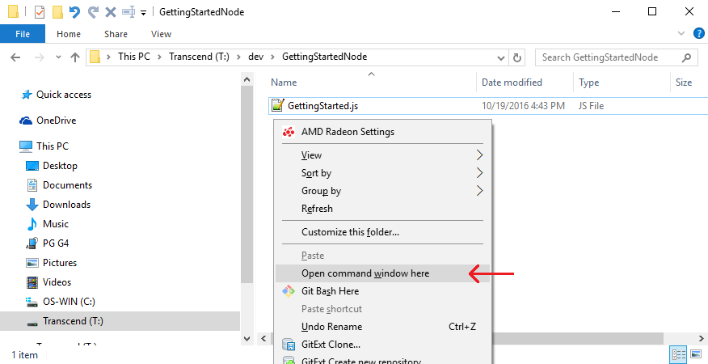

# NodeJS Quickstart

This guide will help you make your first API call in NodeJS.

## Node Project Setup

- OS: This guide is written for Windows 10, however it should also work fine with a Mac
  - Download and install Node.js
    - [https://nodejs.org/en/download/](https://nodejs.org/en/download/)
    - Install, and verify that Node is in your PATH environment variable
      - If you used the installer, it's probably set for you, and it's probably set to the default location: C:/Program Files (x86)/nodejs/

- New Project Setup
  - Create a new folder for your project {NodeProjLocation}:
    - GettingStarted.js

  - Open a command window in your project folder

    

  - Run this command:
    - npm install playfab-sdk

  - Keep this window open (We'll use it again later)

- PlayFab installation complete

## Set up your first API call

This guide will provide the minimum steps to make your first PlayFab API call, without any GUI or on-screen feedback. Confirmation will be done with the Console log.

In your favorite text-editor, update the contents of GettingStarted.js as follows:

> [!NOTE]
> To look up the correct format for the loginRequest object in this example, see the API reference for [LoginWithCustomID](xref:titleid.playfabapi.com.client.authentication.loginwithcustomid).

```javascript
var PlayFab = require("playfab-sdk/PlayFab");
var PlayFabClient = require("playfab-sdk/PlayFabClient");

function DoExampleLoginWithCustomID() {
    PlayFab.settings.titleId = "144";
    var loginRequest = {
        // Currently, you need to look up the correct format for this object in the API reference for LoginWithCustomID.
        TitleId: PlayFab.settings.titleId,
        CustomId: "GettingStartedGuide",
        CreateAccount: true
    };

    PlayFabClient.LoginWithCustomID(loginRequest, LoginCallback);
}

function LoginCallback(error, result) {
    if (result !== null) {
        console.log("Congratulations, you made your first successful API call!");
    } else if (error !== null) {
        console.log("Something went wrong with your first API call.");
        console.log("Here's some debug information:");
        console.log(CompileErrorReport(error));
    }
}

// This is a utility function we haven't put into the core SDK yet. Feel free to use it.
function CompileErrorReport(error) {
    if (error == null)
        return "";
    var fullErrors = error.errorMessage;
    for (var paramName in error.errorDetails)
        for (var msgIdx in error.errorDetails[paramName])
            fullErrors += "\n" + paramName + ": " + error.errorDetails[paramName][msgIdx];
    return fullErrors;
}

// Kick off the acutla login call
DoExampleLoginWithCustomID();
```

## Finish and Execute

- In the console window we opened during installation, run the command:
  - node GettingStarted.js

- You should see the following text as a result:
  - Congratulations, you made your first successful API call!

- At this point, you can start making other API calls, and building your game
- For a list of all available client API calls, see our [PlayFab API References](../../api-references/index.md) documentation.

- Happy coding!

## Deconstruct the code

- Line by line breakdown for GettingStarted.js
  - PlayFab.settings.titleId = "xxxx";
    - Every PlayFab developer creates a title in Game Manager. When you publish your game, you must code that titleId into your game. This lets the client know how to access the correct data within PlayFab. For most users, just consider it a mandatory step that makes PlayFab work.

  - var loginRequest = { TitleId: PlayFab.settings.titleId, CustomId: "GettingStartedGuide", CreateAccount: true };
    - Most PlayFab API methods require input parameters, and those input parameters are packed into a request object
    - Every API method requires a unique request object, with a mix of optional and mandatory parameters
      - For LoginWithCustomIDRequest, there is a mandatory parameter of CustomId, which uniquely identifies a player and CreateAccount, which allows the creation of a new account with this call. TitleId is another mandatory parameter in JavaScript, and it must match PlayFab.settings.titleId

  - PlayFabClientSDK.LoginWithCustomID(loginRequest, LoginCallback);
    - This begins the async request to "LoginWithCustomID", which will call LoginCallback when the API call is complete

  - For login, most developers will want to use a more appropriate login method
    - See the [PlayFab Login documentation](xref:titleid.playfabapi.com.client.authentication) for a list of all login methods, and input parameters. Common choices are:
      - [LoginWithAndroidDeviceID](xref:titleid.playfabapi.com.client.authentication.loginwithandroiddeviceid)
      - [LoginWithIOSDeviceID](xref:titleid.playfabapi.com.client.authentication.loginwithiosdeviceid)
      - [LoginWithEmailAddress](xref:titleid.playfabapi.com.client.authentication.loginwithemailaddress)

- LoginCallback contains two parameters: error, result
  - When successful, error will be null, and the result object will contain the requested information, according to the API called
    - This result contains some basic information about the player, but for most users, login is simply a mandatory step before calling other APIs.

  - If error is not null, your API has failed
    - API calls can fail for many reasons, and you should always attempt to handle failure
    - Why API calls fail (In order of likelihood)
      - PlayFabSettings.TitleId is not set. If you forget to set titleId to your title, then nothing will work.
      - Request parameters. If you have not provided the correct or required information for a particular API call, then it will fail. See error.errorMessage, error.errorDetails, or error.GenerateErrorReport() for more info.
      - Device connectivity issue. Cell-phones lose/regain connectivity constantly, and so any API call at any time can fail randomly, and then work immediately after. Going into a tunnel can disconnect you completely.
      - PlayFab server issue. As with all software, there can be issues. See our [release notes](../../release-notes/index.md) for updates.
      - The internet is not 100% reliable. Sometimes the message is corrupted or fails to reach the PlayFab server.

    - If you are having difficulty debugging an issue, and the information within the error information is not sufficient, please visit us on our [forums](https://community.playfab.com/index.html)
