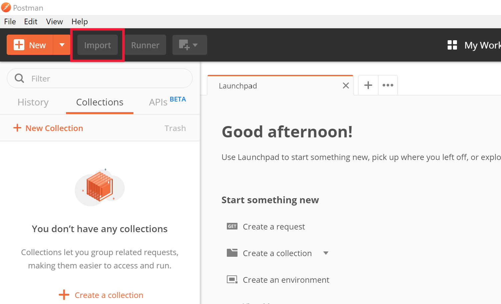
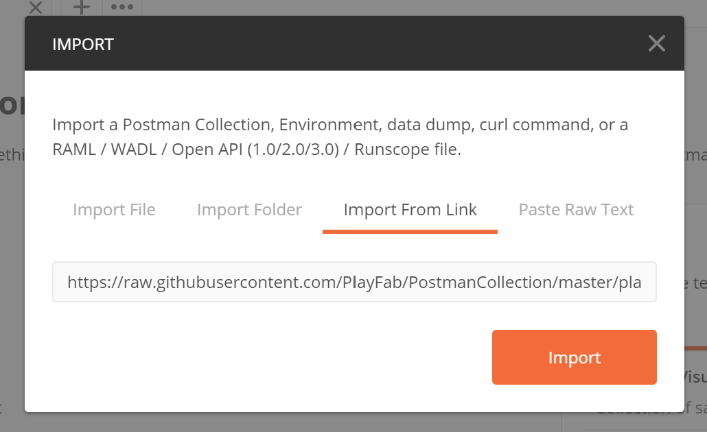
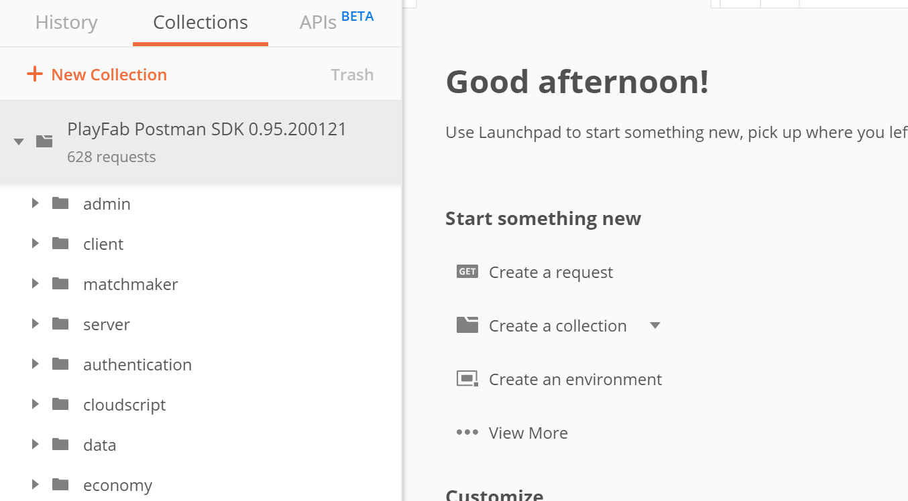
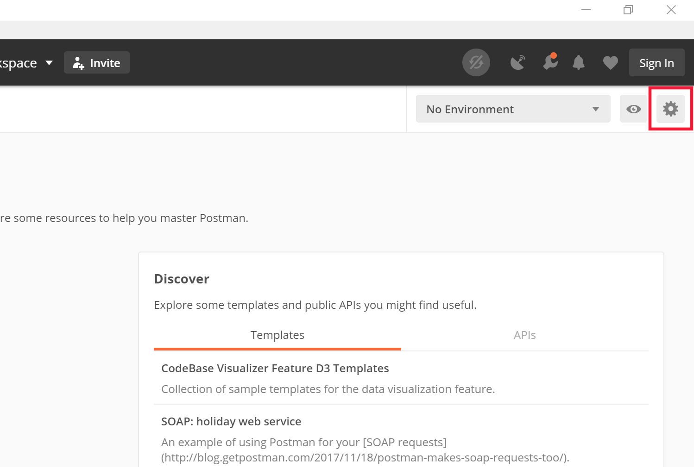
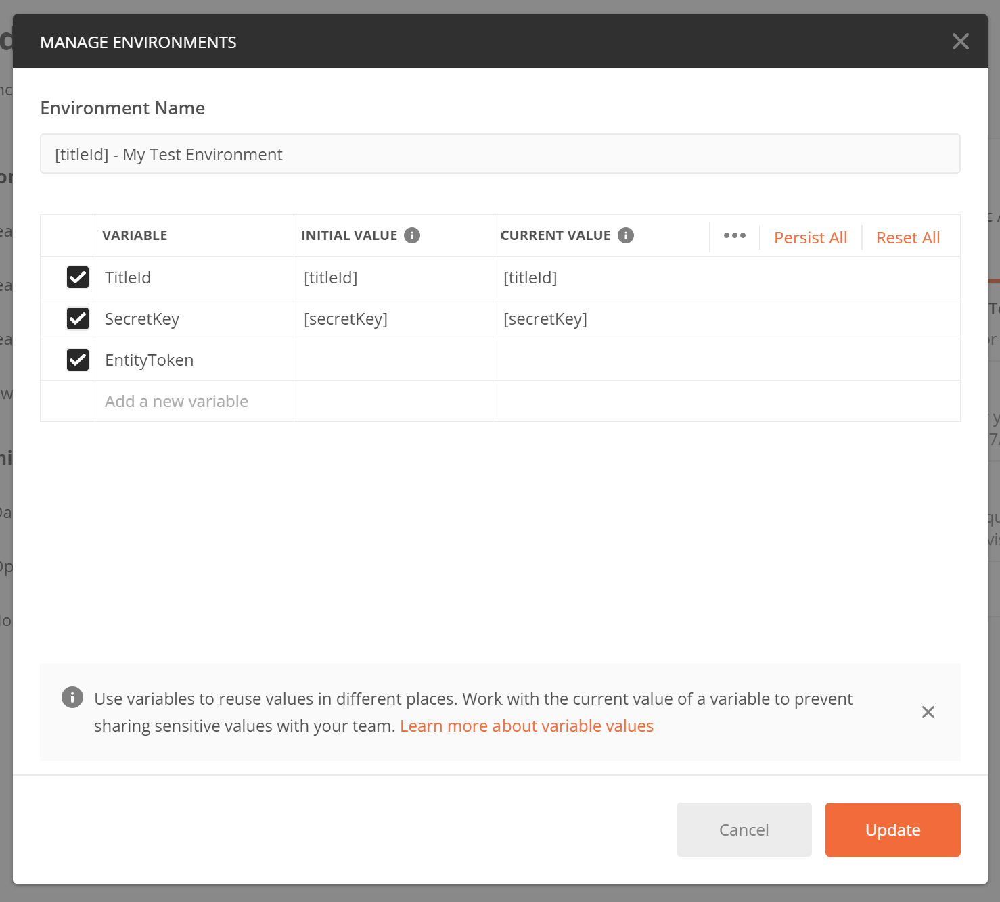
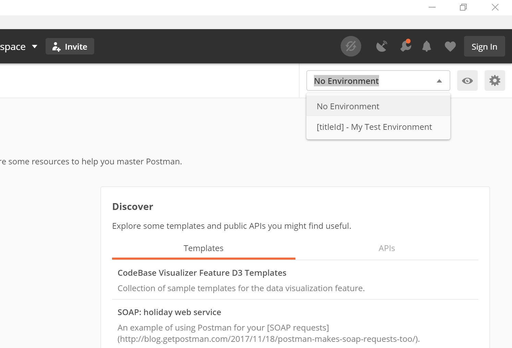
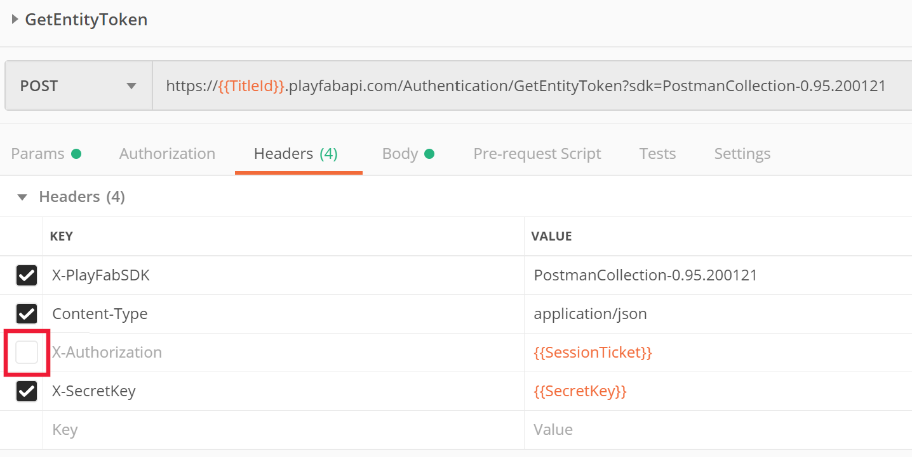

# Quickstart: PlayFab REST API collection for Postman

Get started with the PlayFab REST API collection for Postman. Follow steps to install the package and try out example code for basic tasks. PlayFab is a complete backend platform for live games. Use the PlayFab REST API collection for Postman to:

- Get an entity token
- Add/modify/delete entities in a title
- Configure title content

[API reference documentation](https://docs.microsoft.com/gaming/playfab/api-references/) | [PlayFab Postman Collection GitHub repository](https://github.com/PlayFab/PostmanCollection)

## Prerequisites

- A [PlayFab developer account](https://developer.playfab.com/sign-up)
- The [Postman native app](https://www.getpostman.com/)
- An OS running running [TLS](https://docs.microsoft.com/windows/win32/secauthn/transport-layer-security-protocol) 1.2 or higher ([Windows support for TLS 1.2](https://docs.microsoft.com/dotnet/framework/network-programming/tls#support-for-tls-12))

### Adding PlayFab Collections

- Select **Import** *(top left of the window)*

  > [!div class="mx-imgBorder"]
  > 
- Select **Import From Link**

  > [!div class="mx-imgBorder"]
  > 
- Paste the following link into the URL text box and select **Import**

    https://raw.githubusercontent.com/PlayFab/PostmanCollection/master/playfab.json

  - If you are trying to download the beta SDK, go to the playfab.json file in the [Postman Beta GitHub repository](https://github.com/PlayFab/PostmanBeta/blob/master/playfab.json)
  - Select **View Raw**

    > [!div class="mx-imgBorder"]
    > 
  - Copy the URL from the browser, paste the link into the URL text box and select **Import**
- You should now see the PlayFab Postman SDK under the Collections tab *(top left of the window)*

  > [!div class="mx-imgBorder"]
  > 

### Adding Environment Variables

- Select **Manage Environments** *(cog icon at the top right of the window)*

  > [!div class="mx-imgBorder"]
  > 
- Select **Add** to create a new environment
- Name your environment - we recommend "[titleId] - Test Environment"

> [!NOTE]
> You can find your title id by logging into [Game Manager](https://developer.playfab.com/en-us/my-games) and copying the hex value below your title name on the **My Studios and Titles** main page.

- Add the following 3 variables to the environment:

  | Variable    | Initial Value  | Current Value |
  | ----------- | -------------- | ------------- |
  | TitleId     | [titleId]      | [titleId]     |
  | SecretKey   | [secretKey]    | [secretKey]   |
  | EntityToken |                |               |

> [!NOTE]
> You can learn more about title secret keys and where to find them in the [Secret Key Management](https://docs.microsoft.com/gaming/playfab/features/config/gamemanager/secret-key-management) documentation.

  > [!div class="mx-imgBorder"]
  > 

- When finished, select **Add** _(or Update)_ to save your new environment
- Exit out of the **Manage Environment** window and select the environment dropdown to switch to your new environment *(top right of the window)*

  > [!div class="mx-imgBorder"]
  > 

### Getting a Title Entity Token

One way to interact with PlayFab's [Entity Programming Model](https://docs.microsoft.com/gaming/playfab/features/data/entities/) is to get a Title Entity Token. This can be useful if you want to make changes to title config data, or if you want to make adjustments to a large amount of players:

- Under the **PlayFab Collections** folder, expand the **Authentication** namespace and select `GetEntityToken`
- Under **Headers**, uncheck `X-Authorization`
  
  > [!div class="mx-imgBorder"]
  > 
- Select **Send**
- Set the returned entity token to your `EntityToken` environment variable
  - In the response, highlight the `EntityToken` string (don't forget the '==')
  - Right-click and select **Set: [Environment]** for your new environment
  - Select **EntityToken**
  
    > [!div class="mx-imgBorder"]
    > 

> [!NOTE]
> Entity tokens expire after **24 hours**. Afterwards, you need to re-run `GetEntityToken` to get a new entity token and update your environment variable

### Getting a Title_Player_Account Entity Token

Another way to interact with PlayFab's [Entity Programming Model](https://docs.microsoft.com/gaming/playfab/features/data/entities/) is to get a Title_Player_Account Entity Token. This is useful if you want to make changes to a single player:

- Under the **PlayFab Collections** folder, expand the **Client** namespace and select `LoginWithCustomID`
- Under **Body**, change the `CreateAccount` value from `false` to `true`
- Select **Send**
- Set the returned entity token to your `EntityToken` environment variable
  - In the response, highlight the `EntityToken` string
  - Right-click and select **Set: [Environment]** for your new environment
  - Select **EntityToken**

## Troubleshooting

- Title id / secret key mismatch
  - If you are trying to get a title entity token and receiving a `401: Unauthorized` error, make sure the title id and secret keys are correct by logging into [Game Manager](https://developer.playfab.com/en-us/my-games)
- Expired entity token
  - If you previously obtained an entity token and are unsuccessfully attempting to call other APIs, your entity token might be expired. Get another entity token, save it into the `EntityToken` environment variable, and attempt to call the previous API again
- Incorrect entity token type
  - There are different types of entities (see [Available built-in entity types](https://docs.microsoft.com/gaming/playfab/features/data/entities/available-built-in-entity-types)). Different APIs allow different entity types - for example, you might be attempting to call `GetLanguageList` with a title_player_account entity token instead of a title entity token 
- Incorrect environment:
  - Make sure you are using the proper environment by checking the environment dropdown *(top right of the window)*

## Next Steps

You now have an entity token to pass into other API calls to start setting up your PlayFab title.

> [!div class="nextstepaction"]
> [Getting Started: Developers >](https://docs.microsoft.com/gaming/playfab/personas/developer)
> [!div class="nextstepaction"]
> [PlayFab Quickstarts >](https://docs.microsoft.com/gaming/playfab/index#pivot=documentation&panel=quickstarts)
> [!div class="nextstepaction"]
> [API References >](https://docs.microsoft.com/gaming/playfab/api-references/)
