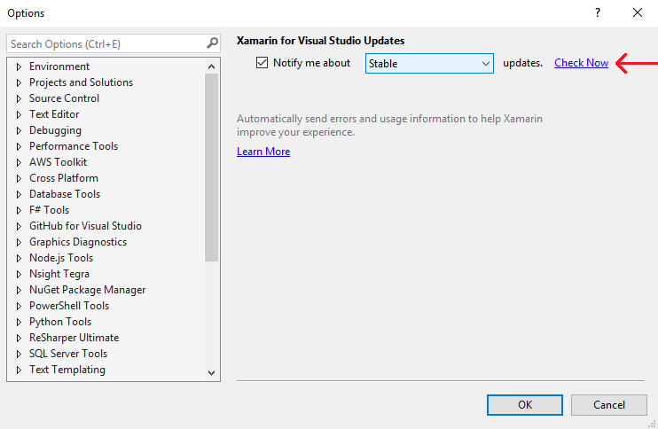
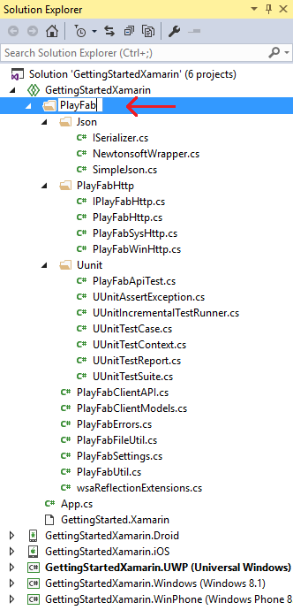
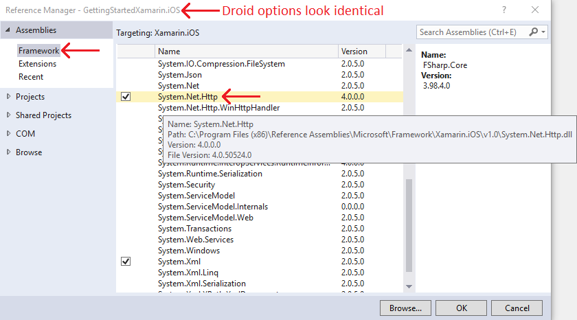

# Xamarin quickstart

This guide will help you make your first PlayFab API call in the Xamarin IDE using C#.

## Xamarin Project Setup

- OS: This guide is written for Windows 10, using Visual Studio 2015
- Download Visual Studio 2015
  - [https://www.visualstudio.com/downloads/](https://www.visualstudio.com/downloads/)

- Download Xamarin for Visual Studio
  - Create an account or log in here: https://www.xamarin.com/download
  - That link should then provide you with a "Download Now" option after login/registration
  - Even with a fresh install, it is a good idea to check for updates
    - Tools -> Options -> Xamarin -> Other -> Check Now

      

- Download and extract the PlayFab Xamarin (C#) SDK
  - [Xamarin (C#) SDK](https://api.playfab.com/downloads/xamarin)
  - This guide will use {CSharpSdkLocation} to describe the extracted location of this SDK

- Open Visual Studio and create a new Cross-Platform Xamarin project
  - This example demonstrates a single Xamarin solution for all mobile platforms at the same time - You may however find it easier to target a single platform per solution
  - Create a new project using these options:
    - Templates -> Visual C# -> Cross-Platform -> Blank App (Xamarin.Forms Shared)

      

  - Popups:
    - Mac agent window: Close this for now
      - If you plan to build for iOS, you'll need to set this up properly later

    - New Universal Windows Project
      - Choose your target version, or just use latest (highest build number) for all options

  - Set your platform and project settings to: x86 & Universal Windows for the remainder of this example
    - The UWP project can run directly on Windows 10, making it easier to demonstrate this example

      

- Import the PlayFab files into your project
  - We will copy/paste those files from the extracted zip we downloaded earlier
    - Keep Visual Studio open
    - Open an Explorer window to {CSharpSdkLocation}/PlayFabClientSDK, and find the "source" sub-folder (don't open it)
    - Drag the "source" sub-folder from the Explorer window, into the non-platform specific "GettingStartedXamarin" project in Visual Studio
    - Once imported, rename the new "source" folder to "PlayFab"
    - If you did this correctly, your "Solution Explorer" panel in Visual Studio should look like this:

      

- Update a few project settings
  - Add "XAMARIN" to all your platform specific properites
    - This flag is not a default for Xamarin, it's an identifier used by the PlayFab CSharpSdk which activates some Xamarin specific code - Mostly you should just consider this a required step
    - For each Project in (GettingStartedXamarin.Droid, GettingStartedXamarin.iOS, GettingStartedXamarin.UWP, GettingStartedXamarin.Windows, GettingStartedXamarin.WinPhone)
      - RClick -> Properties -> Left-Menu: Build -> "Conditional compilation symbols:" -> Append ";XAMARIN" to existing symbols (if any)
      - Each of these panels looks a little different, but each one should have this option

  - Android specific settings
    - RClick GettingStartedXamarin.Droid -> Properties (If you closed it, otherwise you already opened this window above)
      - Left-Menu: Android Manifest -> Required Permissions -> Check "Internet"
      - Left-Menu: Application -> Depending on your AndroidSDK installation, choose your SDK (In all 3 options, this guide uses "Android 6.0 (API Level 23 - Marshmallow)")
        - Xamarin installation prompted you to install the AndroidSDK
          - You can navigate to that folder, and run "SDK Manager.exe" to modify which Android APIs you have available

  - Additional References
    - For each Project in (GettingStartedXamarin.Droid, GettingStartedXamarin.iOS)
      - In Solution Explorer panel, expand each project, and RClick "References" -> Add Reference
        - Find "System.Net.Http" and activate the checkbox

          

- Your project should now compile
  - You likely have several warnings
    - The Android warnings almost certainly prevent you from testing or building to an actual device
      - Commit to a source code repository before you attempt to resolve Android warnings - These issues are insidious, and it's possible to permanently break your project

    - GettingStartedXamarin.Windows, and GettingStartedXamarin.UWP projects
      - These are missing a certificate, which is required for deploying builds
      - However, this will NOT prevent you from running a debug build on your local machine

  - This guide does not require that you resolve these warnings

- PlayFab installation complete!

## Set up your first API call

This guide will provide the minimum steps to make your first PlayFab API call, without any GUI or on-screen feedback. Confirmation will be done with an on-screen text widget.

- In Visual Studio, Solution Explorer (panel), find this file: Solution/GettingStartedXamarin/App.cs
- Replace the contents of App.cs with the following:

```csharp
using System;
using System.Threading.Tasks;
using PlayFab;
using PlayFab.ClientModels;
using Xamarin.Forms;

namespace GettingStartedXamarin
{
    public class App : Application
    {
        private readonly Label _myLabel;
        private string _myLabelText = "Logging into PlayFab...";

        public App()
        {
            _myLabel = new Label { HorizontalTextAlignment = TextAlignment.Center, Text = _myLabelText };

            // The root page of your application
            MainPage = new ContentPage
            {
                Content = new StackLayout { VerticalOptions = LayoutOptions.Center, Children = { _myLabel } }
            };

            LogIntoPlayFab();
            Device.StartTimer(TimeSpan.FromMilliseconds(16), Tick);
        }

        private bool Tick()
        {
            lock (_myLabelText)
            {
                _myLabel.Text = _myLabelText;
            }
            return true;
        }

        private void LogIntoPlayFab()
        {
            PlayFabSettings.TitleId = "144";
            var request = new LoginWithCustomIDRequest { CustomId = "GettingStartedGuide", CreateAccount = true };
            var loginTask = PlayFabClientAPI.LoginWithCustomIDAsync(request);
            loginTask.ContinueWith(OnLoginComplete);
        }

        private void OnLoginComplete(Task<PlayFabResult<LoginResult>> task)
        {
            var newLabel = "Unknown failure";
            if (task.Result.Result != null)
            {
                newLabel = "Congratulations, you made your first successful API call!";
            }
            if (task.Result.Error != null)
            {
                newLabel = "Something went wrong with your first API call.\n"
                    + "Here's some debug information:\n"
                    + task.Result.Error.GenerateErrorReport();
            }
            lock (_myLabelText)
            {
                _myLabelText = newLabel;
            }
        }
    }
}
```

## Finish and Execute

- Run this project
  - Build (dropdown) -> Start Debugging

- The first time you run a UWP program, it can take a long time to load
- When it loads, you should see the following text:
  - "Congratulations, you made your first successful API call!"

- At this point, you can start making other API calls, and building your game
- For a list of all available client API calls, see our [PlayFab API References](../../api-references/index.md) documentation.

  
- Happy coding!

## Deconstruct the code

This optional last section describes each part of App.cs in detail.

- App class and App() constructor
  - These are the Xamarin template lines, trivially modified so that we can update the text-label as we process the login event

- Device.StartTimer(TimeSpan.FromMilliseconds(16), Tick); and Tick()
  - PlayFab API calls are executed on another thread. You can't set myLabel.Text from the other thread, so you must set up a thread-safe communication mechanism

- LogIntoPlayFab
  - PlayFabSettings.TitleId = "144";
    - Every PlayFab developer creates a title in Game Manager. When you publish your game, you must code that titleId into your game. This lets the client know how to access the correct data within PlayFab. For most users, just consider it a mandatory step that makes PlayFab work.

  - var request = new LoginWithCustomIDRequest { CustomId = "GettingStartedGuide", CreateAccount = true };
    - Most PlayFab API methods require input parameters, and those input parameters are packed into a request object
    - Every API method requires a unique request object, with a mix of optional and mandatory parameters
      - For LoginWithCustomIDRequest, there is a mandatory parameter of CustomId, which uniquely identifies a player and CreateAccount, which allows the creation of a new account with this call.

    - For login, most developers will want to use a more appropriate login method
      - See the [PlayFab Login documentation](xref:titleid.playfabapi.com.client.authentication) for a list of all login methods, and input parameters. Common choices are:
        - [LoginWithAndroidDeviceID](xref:titleid.playfabapi.com.client.authentication.loginwithandroiddeviceid)
        - [LoginWithIOSDeviceID](xref:titleid.playfabapi.com.client.authentication.loginwithiosdeviceid)
        - [LoginWithEmailAddress](xref:titleid.playfabapi.com.client.authentication.loginwithemailaddress)

  - var loginTask = PlayFabClientAPI.LoginWithCustomIDAsync(request);
    - This kicks off the thread which will execute the login call

  - loginTask.ContinueWith(OnLoginComplete);
    - This queues up the OnLoginComplete function to execute after the login call has completed
    - OnLoginComplete will receive the result information from that task

  - private void OnLoginComplete(Task<PlayFabResult<LoginResult>> task)
    - This is the callback, which receives the information about the success or failure of the login, and the returned data from that call
    - task.Result.Result;
      - When successful, Result object of many API callbacks will contain the requested information
      - If not-null, LoginResult-type contains some basic information about the player, but for most users, login is simply a mandatory step before calling other APIs.

    - task.Result.Error;
      - If apiError is not null, your API has failed
      - API calls can fail for many reasons, and you should always attempt to handle failure
      - Why API calls fail (In order of likelihood)
        - PlayFabSettings.TitleId is not set. If you forget to set titleId to your title, then nothing will work.
        - Request parameters. If you have not provided the correct or required information for a particular API call, then it will fail. See error.errorMessage, error.errorDetails, or error.GenerateErrorReport() for more info.
        - Device connectivity issue. Cell-phones lose/regain connectivity constantly, and so any API call at any time can fail randomly, and then work immediately after. Going into a tunnel can disconnect you completely.
        - PlayFab server issue. As with all software, there can be issues. See our [release notes](../../release-notes/index.md) for updates.
        - The internet is not 100% reliable. Sometimes the message is corrupted or fails to reach the PlayFab server.

      - If you are having difficulty debugging an issue, and the information within the error information is not sufficient, please visit us on our [forums](https://community.playfab.com/index.html)